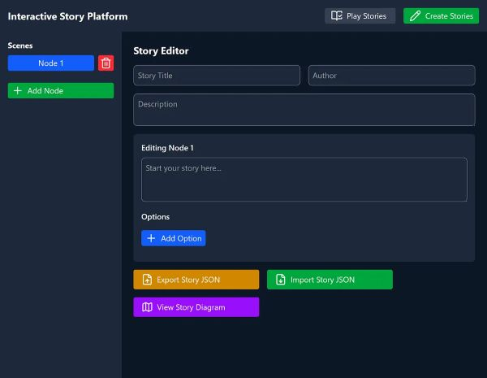

# Stories Platform

A web-based tool for creating and reading interactive, branching text stories.

  

## 📋 Table of Contents

- [Features](#features)
- [Installation](#installation)
- [Screenshots/Video](#screenshots)
- [Tech Stack](#tech-stack)
- [Current version](#current-version)
- [Contact Info](#contact-info)

## <a id="features"></a>📌 Features

- Create interactive stories with multiple choices
- View stories structure through diagram
- Import existing stories and export created ones ([exported file example](src/assets/sampleStory.json))
- Add/delete/modify stories choices and structure
- Upload existing stories to explore them interactively

## <a id="installation"></a>🛠️ Installation

Clone the repository and install dependencies.

### Terminal commands

```bash
npm install
npm run dev
```

App runs at: http://localhost:5173

Once the project is running:

- Navigate to the appropriate page from the Home page or Header (Story Player / Story Editor; Play / Create tabs)
- Check Instructions or About page for additional information
- Story Player interface can be accessed through the Story Player page (Play tab)
- Users can view a simple example of an interactive story
- Users can upload other stories in JSON format
- Create tab switches page to Story Editor
- Users can fill in the fields to create their own interactive stories
- Users can add/delete/edit stories nodes and stories choices
- Users can view story diagram with nodes and choices
- Users can import existing stories into the editor or export the ones they create in JSON or HTML format

## <a id="screenshots"></a>📷 Screenshots/Video

### Story Player


**Caption:** Story player interface to read interactive stories.

### Story Editor



**Caption:** Story editor interface to create interactive stories.

### Story Diagram


**Caption:** Story diagram to view stories structure.

### Video demonstration


**Caption:** Stories platform overview.

## <a id="tech-stack"></a>⚙️ Tech Stack

- JavaScript
- React
- React Router
- Tailwind CSS
- React Flow
- Dagre
- uuid
- Lucide (icons)
- Netlify (deployment)

## <a id="current-version"></a>🔗 Current version

Initial version with basic functionality and simple interface.

[Live version](https://stories-platform.dimterion.com/)

[Roadmap](docs/ROADMAP.md) of potential features and improvements.

## 📄 License

This project is licensed under the MIT License – see the [LICENSE](LICENSE) file for details.

## <a id="contact-info"></a>📫 Contact info

### Profile links ⬇️

<a href="https://linktr.ee/dimterion">
  
</a>

**Note:** Ctrl+Click (Windows/Linux) or Cmd+Click (macOS) the image to open link in a new tab.
