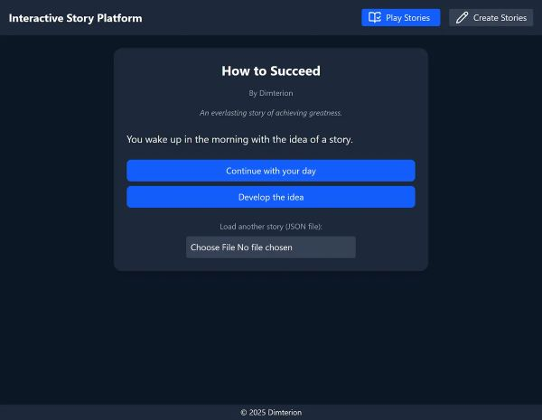
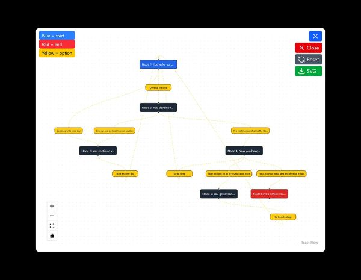

# Stories Platform

A web-based tool for creating and reading interactive, branching text stories.

  

## 📋 Table of Contents

- [Features](#features)
- [Installation](#installation)
- [Screenshots](#screenshots)
- [Tech Stack](#tech-stack)
- [Current version](#current-version)
- [Contact Info](#contact-info)

## <a id="features"></a>📌 Features

- Create interactive stories with multiple choices
- View stories structure through diagram
- Import existing stories and export created ones
- Add/delete/modify stories choices and structure
- Upload existing stories to explore them interactively

## <a id="installation"></a>🛠️ Installation

Clone the repository and install dependencies.

### Terminal commands

```bash
npm install
npm run dev
```

App runs at: http://localhost:5173

Once the project is running:

- Story Player interface can be seen (Play Stories tab)
- Users can view a simple example of an interactive story
- Users can upload other stories in JSON format
- Create Stories tab switches interface to Story Editor
- Users can fill in the fields to create their own interactive stories
- Users can add/delete/edit stories nodes and stories choices
- Users can view story diagram with nodes and choices
- Users can import existing stories into the editor or export the ones they create in JSON format

## <a id="screenshots"></a>📷 Screenshots

### Story Player



**Caption:** Story player to read interactive stories.

### Story Editor


**Caption:** Story editor to create interactive stories.

### Story Diagram



**Caption:** Story diagram to view stories structure.

## <a id="tech-stack"></a>⚙️ Tech Stack

- JavaScript
- React
- Tailwind CSS
- React Flow
- Dagre
- uuid

## <a id="current-version"></a>🔗 Current version

MVP with basic functionality and simple interface.

[Live version](https://stories-platform.dimterion.com/)

## 📄 License

This project is licensed under the MIT License – see the [LICENSE](LICENSE) file for details.

## <a id="contact-info"></a>📫 Contact info

### Profile links ⬇️

<a href="https://linktr.ee/dimterion">
  
</a>

**Note:** Ctrl+Click (Windows/Linux) or Cmd+Click (macOS) the image to open link in a new tab.
